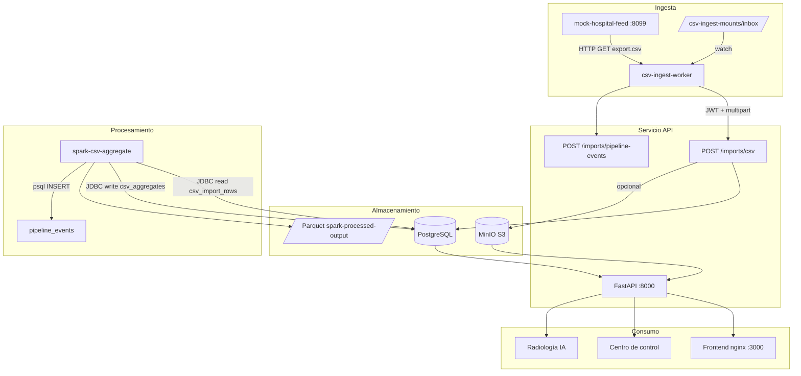

# Flujo de datos end-to-end — laSalle Health Center

Documento de arquitectura que describe cómo circulan los datos clínicos/operativos entre ingesta, almacenamiento, procesamiento, servicio y visualización.

## Diagrama general

## Fases del pipeline (requisito Big Data)

| Fase | Componente | Entrada | Salida |
|------|------------|---------|--------|
| **Ingesta** | `csv-ingest-worker`, UI Imports | CSV (HTTP o carpeta) | Filas en `csv_import_rows`, lote en `csv_import_batches` |
| **Almacenamiento** | PostgreSQL, MinIO | Filas validadas, imágenes RX | Tablas relacionales + objetos en bucket |
| **Procesamiento** | PySpark `local[*]` | `csv_import_rows` | `csv_aggregates` + Parquet por `batch_id` |
| **Servicio** | FastAPI | Consultas JWT | JSON para portal, informes, métricas RX |
| **Visualización** | HTML/Chart.js | Endpoints dashboard | KPIs, alertas, gráficos |

## Tablas clave (PostgreSQL)

| Tabla | Propósito |
|-------|-----------|
| `csv_import_batches` | Metadatos de cada lote importado |
| `csv_import_rows` | Filas normalizadas del CSV |
| `csv_aggregates` | Conteos agregados por Spark |
| `data_quality_issues` | Incidencias de calidad (duplicados, campos vacíos) |
| `pipeline_events` | Auditoría de etapas (ingesta, Spark, errores) |
| `patients`, `studies`, `users` | Dominio clínico del portal |

## Radiología (datos no estructurados)

1. Imagen subida vía `POST /radiology/predict` (multipart).
2. Preprocesado en API (redimensionado, normalización).
3. Inferencia con modelo empaquetado en imagen Docker (`model_final.pkl`).
4. Respuesta: clase predicha, probabilidades, disclaimer ético en UI.

El entrenamiento offline vive en `ml/radiology-classifier/`; los artefactos se copian en build de `services/api/Dockerfile`.

## Monitorización y calidad

- **Logs:** contenedores `api`, `csv-ingest-worker`, `spark-csv-aggregate` (driver `json-file` con rotación).
- **Salud:** `GET /health`, `/health/deps`, `/health/pipeline`, `/health/observability`.
- **Calidad:** reglas en `dashboard_imports.py` → `data_quality_issues`.
- **Alertas:** `GET /alerts` fusiona pipeline + calidad para admin/médico.

Ver también: [`infra/observability/README.md`](../../infra/observability/README.md), [`pipelines/quality/README.md`](../../pipelines/quality/README.md).

## Escalabilidad (diseño vs. demo)

El diseño permite escalar horizontalmente:

- Sustituir `local[*]` por cluster Spark (YARN/K8s).
- Externalizar MinIO a S3 gestionado.
- Particionar `csv_import_rows` por `batch_id` o fecha.
- Añadir cola (Kafka/RabbitMQ) entre ingesta y API.

En el proyecto académico se prioriza **reproducibilidad con un solo `docker compose up`**.

## Referencias

- Orquestación: [`pipelines/orchestration/README.md`](../../pipelines/orchestration/README.md)
- Specs SDD: [`docs/specs/`](../specs/)
- ADRs: [`docs/adr/`](../adr/)
