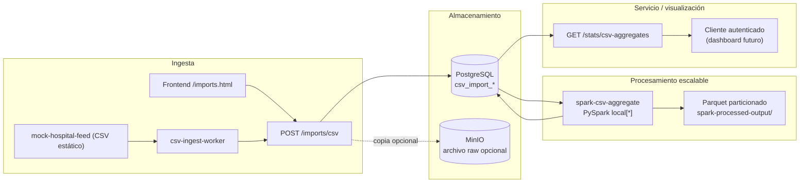

# Flujo de datos (ingesta → almacén → procesamiento → servicio)

Vista de referencia para la memoria técnica y la presentación. Describe el **pipeline cerrado** tras la integración del job PySpark (`feature/pipeline`).

## Diagrama (Mermaid)

## Resumen narrativo

1. **Ingesta**: operadores o el worker automatizado envían CSV al API; deduplicación y calidad persisten en PostgreSQL; opcionalmente se archiva el fichero en MinIO.
2. **Almacén**: la verdad tabular vive en Postgres; el almacén de objetos cubre el requisito de **datos no estructurados / copias raw**.
3. **Procesamiento**: el contenedor Spark lee `csv_import_rows` por JDBC, calcula agregados por lote, actualiza las tablas `csv_spark_*` y materializa **Parquet** en volumen (capa analítica simulada).
4. **Servicio**: la API expone `GET /stats/csv-aggregates` para consumo desde el portal o un dashboard; el diagrama deja el nodo de visualización abierto a evolución UI.

## Referencias

- SDD PySpark: [`docs/specs/pyspark-csv-aggregates.md`](../specs/pyspark-csv-aggregates.md)
- ADR: [`docs/adr/0002-pyspark-local-csv-aggregates.md`](../adr/0002-pyspark-local-csv-aggregates.md)
- SDD ingesta automática: [`docs/specs/automated-csv-ingestion.md`](../specs/automated-csv-ingestion.md)
