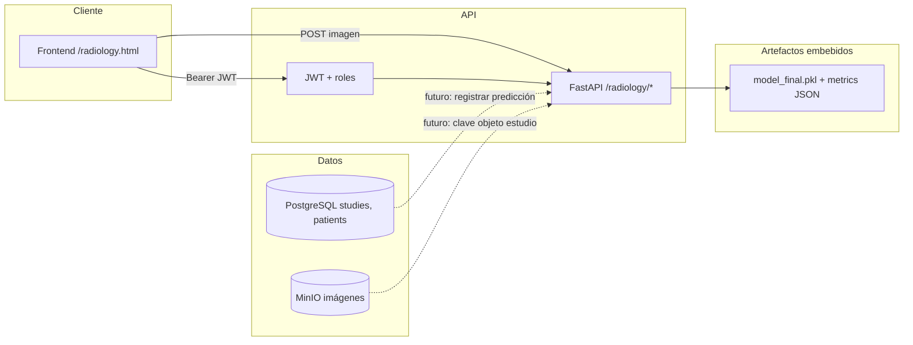

# Integración del módulo de radiografía con el resto del sistema

## Vista lógica

## Flujo actual (MVP)

1. Usuario **admin** o **médico** inicia sesión en el portal.
2. Abre **`/radiology.html`**, obtiene métricas agregadas (`GET /radiology/metrics`).
3. Sube una imagen de prueba → `POST /radiology/predict` con el fichero en multipart.
4. La API carga el **joblib** desde `/app/models/radiology/` (copiado en build Docker desde `bootstrap_model.py`).

## Extensión al modelo de estudios del hospital

La base ya contempla **estudios** con `image_s3_bucket` / `image_s3_key` en PostgreSQL (ver rutas `/studies`). Evolución recomendada:

1. Tras subir DICOM/PNG a MinIO y crear fila en `studies`, un worker o la propia API invoca el mismo preprocesado que `radiology.py`.
2. Persistir en tabla auxiliar `study_radiology_predictions(study_id, model_version, probs jsonb, predicted_label, created_at)`.
3. Mostrar en ficha de paciente solo a roles autorizados.

## Build y despliegue

- **Compose**: contexto monorepo en `infra/docker/docker-compose.yml` para el servicio `api`.
- **Dockerfile**: etapa `radiology-build` ejecuta `scripts/bootstrap_model.py` y copia artefactos al runtime.
