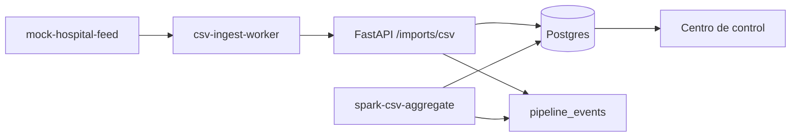

# Orquestación del pipeline

Flujo automatizado de datos hospitalarios (CSV → API → Postgres → Spark → dashboard).

## Servicios Docker

| Servicio | Script / imagen | Intervalo |
|----------|-----------------|-----------|
| `csv-ingest-worker` | `automated_csv_ingest.py` | `INGEST_POLL_INTERVAL_SECONDS` (90s) |
| `spark-csv-aggregate` | `run_loop.sh` + PySpark | `SPARK_AGGREGATE_INTERVAL_SECONDS` (300s) |

## Eventos

Ambos componentes registran etapas en `pipeline_events` para auditoría y alertas (`GET /alerts`).

Documentación detallada: [`docs/architecture/pipeline-dataflow.md`](../../docs/architecture/pipeline-dataflow.md).
